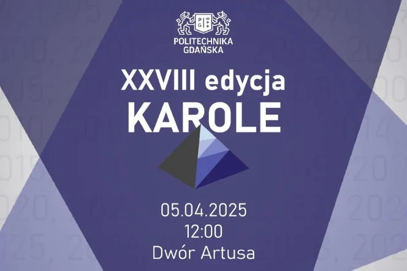
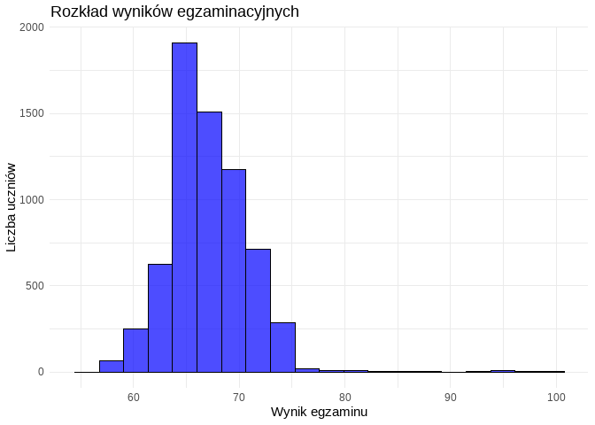
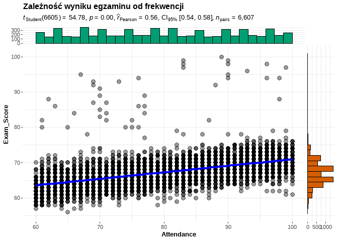
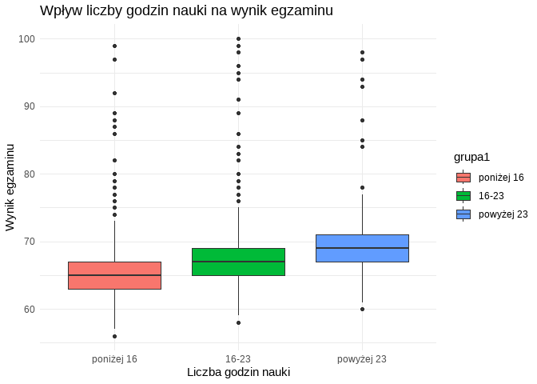

# 📊 Analysis of Factors Affecting Exam Performance  

  
*Nomination in the 28th edition of the KAROLE Competition – Artus Court, Gdańsk, 2025*

**Authors:** Bartosz Kurzyński, Jakub Kołpaczyński, Stanisław Kolas  
**Nomination:** 28th edition of the [KAROLE Competition](https://zie.pg.edu.pl/aktualnosci/2025-03/karole-2025-rusza-xxviii-edycja-prestizowego-konkursu) – Gdańsk University of Technology 🏅  

---

## ℹ️ About the KAROLE Competition
The **KAROLE** competition (*Konkurs Aplikacji Rozwiązań Oprogramowania i Logicznych Eksperymentów*) has been organized since 1993 by the **Faculty of Management and Economics at the Gdańsk University of Technology**.  
It recognizes the best student projects that combine **innovation, high-quality execution, and practical application**.  

Finalists have the opportunity to:
- 🧠 **Develop advanced analytical skills** and work with complex datasets  
- 🛠 **Gain practical experience** in executing applied research projects  
- 🌐 **Present results** to both academic and industry audiences  

**Grand Final of the 28th edition:** *April 5, 2025 – Artus Court, Gdańsk*.

---

## 🎯 Project Goal
This project investigates **factors influencing the exam performance of high school students**.  
The aim is to **identify the most significant variables** — such as study hours, attendance, access to learning resources, and parental involvement — that most strongly determine academic success.  

The findings can be applied by:
- Teachers and schools to **optimize teaching strategies**  
- Policymakers to **design targeted support programs**  
- Education researchers for further in-depth analysis

---

## 🗂 Data Structure
The dataset (`czynniki.csv`) includes:
- **Numerical variables:** `Hours_Studied`, `Attendance`, `Tutoring_Sessions`, `Exam_Score`, etc.  
- **Categorical variables:** `Parental_Involvement`, `Access_to_Resources`, `School_Type`, `Gender`, etc.

Key example variables:
- `Hours_Studied` – weekly study hours  
- `Attendance` – percentage of classes attended  
- `Parental_Involvement` – parental engagement (`Low`, `Medium`, `High`)  
- `Access_to_Resources` – access to learning resources (`Low`, `Medium`, `High`)  
- `Exam_Score` – final exam score (0–100 points)

---

## 🔍 Scope of Analysis
The project includes:
1. **Data preprocessing**
   - Value verification and validation  
   - Handling missing values (*hot-deck imputation*)
2. **Exploratory Data Analysis (EDA)**
   - Detecting missing values and outliers  
   - Descriptive statistics and variable distributions
3. **Relationship analysis**
   - Spearman correlations  
   - Linear regression models  
   - ANOVA and post-hoc tests
4. **Visualization**
   - Histograms, boxplots, scatterplots with regression lines  
   - Interactive charts (*plotly*)
5. **Statistical inference**
   - Significance testing  
   - Analysis of individual factor impacts on exam results

---

## 📌 Key Findings
- **Strongest positive effects:** class attendance and weekly study hours  
- **Tutoring sessions:** positive but moderate influence  
- **Negative correlations:** low family income, limited learning resources, low parental involvement  
- The linear regression model explains **~62% of the variance in exam results (R² = 0.6228)**

---

## ⚙️ Tech Stack
- **Language:** R  
- **Libraries:** `tidyverse`, `ggplot2`, `finalfit`, `VIM`, `validate`, `errorlocate`, `ggcorrplot`, `ggthemes`, `plotly`, `ggstatsplot`, `moments`, `kableExtra`, `gtsummary`  
- **Output format:** HTML with interactive charts

---

## 📄 Final Output
The HTML report includes:
- Problem statement and project objective  
- Dataset description  
- Statistical analysis results  
- Conclusions and practical recommendations

---

## 🖼 Screenshots & Visualizations

### Example – Distribution of Exam Scores

### Example – Relationship Between Attendance and Exam Score

### Example – Influence of Study Hours

---

## 🏅 KAROLE Nomination Context
This project was nominated for the **28th edition of the prestigious KAROLE competition** organized by the **Gdańsk University of Technology**.  
The jury recognized:
- **Innovative approach** to educational data analysis  
- **Comprehensive documentation** and a complete data validation workflow  

---

## 📬 Contact
- Stanisław Kolas – [LinkedIn](https://www.linkedin.com/in/stanis%C5%82aw-kolas-31038026a)  
- Repository: *[(link to repository)](https://github.com/stanislawkolas/Data-Analysis-of-Exam-Results.git)*

---
