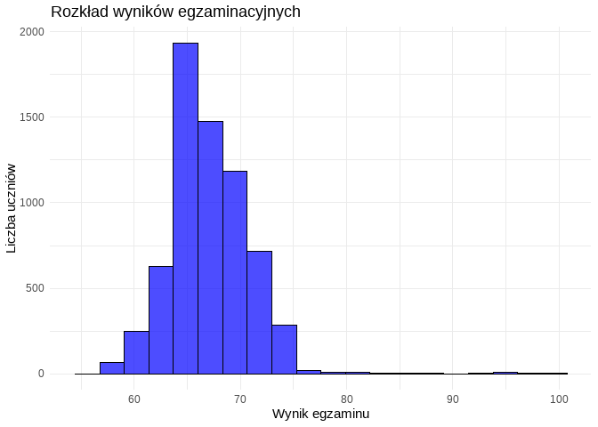
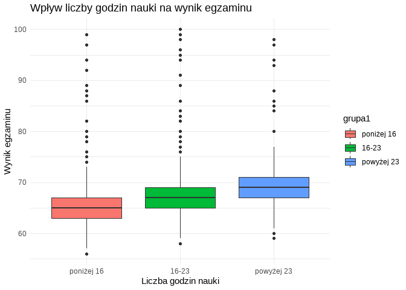
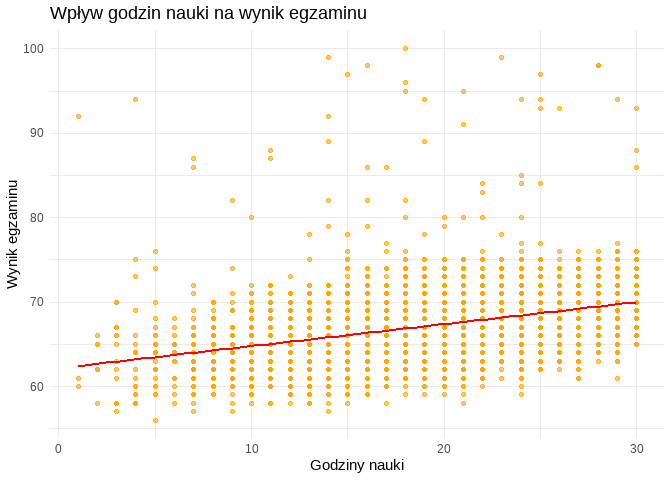
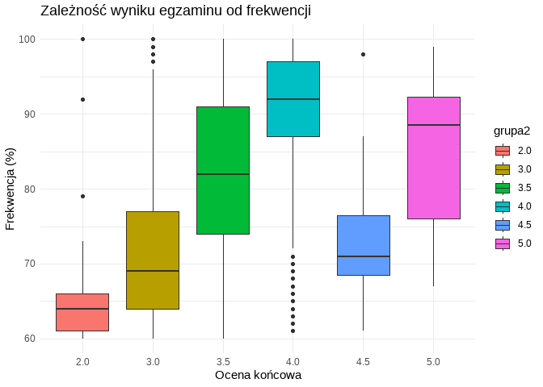
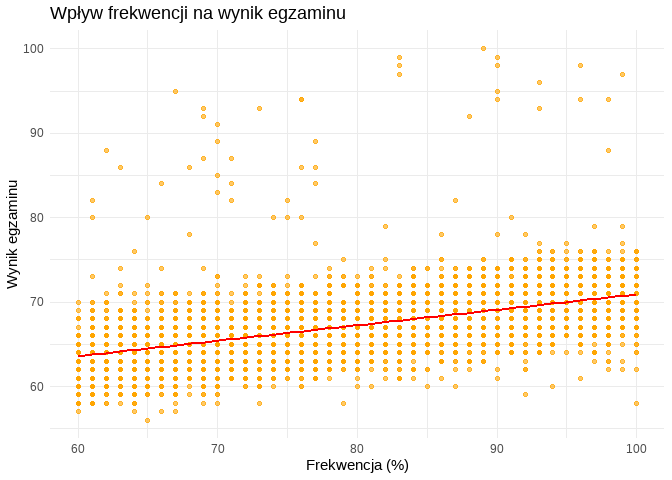
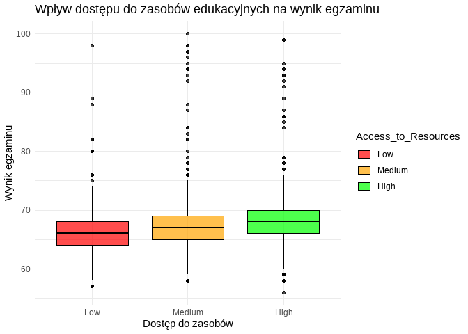
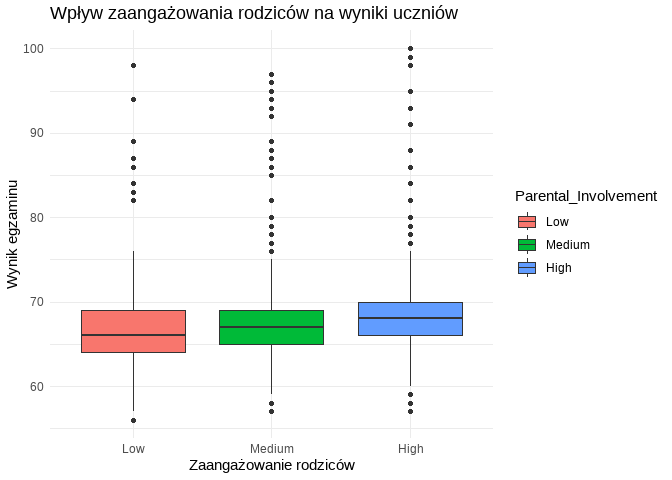
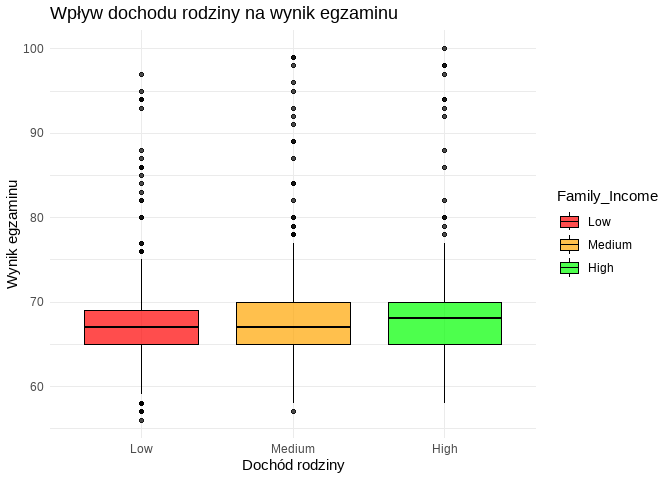
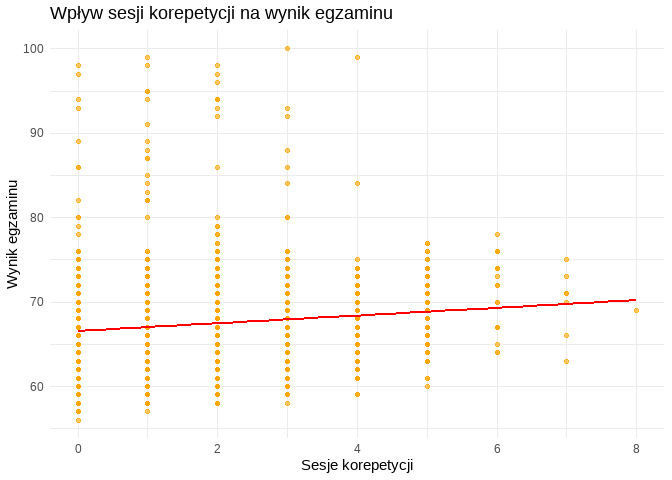

# Analiza czynników wpływających na wyniki z egzaminów studentów

## Wstęp

### Cel projektu

Celem projektu jest analiza czynników wpływających na wyniki uczniów w
egzaminach. Badanie ma na celu zidentyfikowanie, które zmienne, takie
jak liczba godzin nauki, frekwencja czy wsparcie rodziny, mają
największy wpływ na sukces akademicki. Wyniki analizy mogą pomóc w
optymalizacji strategii edukacyjnych oraz wdrożeniu skutecznych metod
wsparcia dla uczniów o niższych wynikach.

### Opis problemu

Osiągnięcia akademickie uczniów są determinowane przez wiele czynników –
zarówno indywidualnych, jak i środowiskowych. Trudności w nauce, poziom
zaangażowania rodziców, dostęp do zasobów edukacyjnych czy aktywności
pozalekcyjne mogą znacząco wpływać na ostateczne wyniki. Analiza tych
czynników pozwoli na lepsze zrozumienie zależności i wsparcie uczniów w
poprawie wyników.

### Znaczenie analizy wyników uczniów

Zrozumienie czynników wpływających na wyniki egzaminacyjne jest istotne
z kilku powodów:

Optymalizacja strategii nauczania – analiza wyników może pomóc
nauczycielom i decydentom edukacyjnym w dostosowaniu metod nauczania do
potrzeb uczniów.

Wsparcie dla uczniów w trudnej sytuacji – identyfikacja kluczowych
czynników umożliwia wdrożenie skutecznych programów pomocy.

Poprawa efektywności edukacji – lepsze zrozumienie procesów nauczania
pozwala na skuteczniejsze zarządzanie systemem edukacyjnym.

## Opis danych

### Źródło danych

Dane wykorzystane w analizie pochodzą z anonimowego zbioru danych
dotyczącego uczniów szkół średnich. Zawierają one informacje na temat
wyników egzaminacyjnych oraz czynników potencjalnie wpływających na
sukces akademicki.

### Struktura zbioru danych

Zbiór danych zawiera następujące kolumny:

Zmienne numeryczne: Liczba godzin nauki, frekwencja, liczba sesji
korepetycji, wynik egzaminu itp.

Zmienne kategoryczne: Poziom zaangażowania rodziców, dostęp do zasobów
edukacyjnych, typ szkoły, aktywności pozalekcyjne itp.

### Opis zmiennych

Każda z analizowanych zmiennych pełni określoną funkcję w kontekście
analizy wyników uczniów. Główne zmienne to:

-   Hours Studied – liczba godzin nauki tygodniowo.

-   Attendance – procentowa frekwencja na zajęciach.

-   Tutoring Sessions – liczba godzin spędzonych na korepetycjach.

-   Parental Involvement – poziom zaangażowania rodziców (Low, Medium,
    High).

-   Access to Resources – dostęp do zasobów edukacyjnych (Low, Medium,
    High).

-   Motivation Level – poziom motywacji ucznia.

-   Previous Scores – wyniki ucznia z poprzednich egzaminów.

-   Exam Score – wynik końcowy z egzaminu.

Dane te zostaną poddane dalszej analizie w celu określenia ich wpływu na
końcowe wyniki uczniów.

## Przygotowanie danych

### Wizualizacja brakujących danych

Aby lepiej zrozumieć rozkład brakujących danych w naszym zbiorze,
wykonujemy kilka analiz:

-   Wykres `missing_plot()` przedstawia ogólny wzór brakujących wartości
    dla kluczowych zmiennych.

<!-- -->

Po zwizualizowaniu brakujących wartości za pomocą wykresu
`missing_plot()` można zauważyć, że w zbiorze danych występują braki w
kilku zmiennych.

<!-- -->

Po przealizowaniu przedstawionych wykresów można dość do wnioksku, iż
brakujące dane nie są w żaden sposób skorelowane z innymi zmiennymi.
Można stwierdzić, że braki w danych są losowe.

### Czyszczenie danych i imputacja brakujących wartości

Pierwszą rzeczą jest ustalenie reguł dla wszystkich danych istniejących
oraz imputowanych. Pozwala to na usunięcie wartości skrajnie
odstających, które mogły być błędem przy wprowadzaniu danych.


Po zastosowaniu zasad w jakich dane mają być skondensowane mogły
wystąpić wartości puste (NA). Wartości te powstały w miejscach wartości,
które nie spełniały powyższych zasad.

Po uprzednim przygotowaniu danych oraz ich zidentyfikowaniu należy
przejść do imputacji danych. Do imputacji wybrano metodę hotdeck, która
polega na zastępowaniu brakujących wartości rzeczywistych danymi z tego
samego zbioru.

Przed przystąpieniem do analizy konieczne było usunięcie brakujących
wartości oraz poprawienie błędów w danych.

<!-- -->

Po zwizualizowaniu danych można zauważyć, że nie ma już pustych wartości
w danych. Zostały one skutecznie zastąpione za pomoca zastosowanej
metody.

### Analiza zależności między zmiennymi

Analiza korelacji i zależności między zmiennymi pozwala określić, które
czynniki mają największy wpływ na wyniki egzaminacyjne. Przeprowadzona
analiza obejmuje obliczenie współczynników korelacji Spearmana dla
kluczowych zmiennych oraz ich wpływu na wynik końcowy.


```
##                 Attendance.rho              Hours_Studied.rho 
##                    0.637120746                    0.406801037 
##            Previous_Scores.rho          Tutoring_Sessions.rho 
##                    0.178467896                    0.152849282 
##             Peer_Influence.rho        Access_to_Resources.rho 
##                    0.106151632                    0.095083255 
##      Learning_Disabilities.rho         Distance_from_Home.rho 
##                    0.093204315                    0.090811090 
##       Parental_Involvement.rho Extracurricular_Activities.rho 
##                    0.073548862                    0.063160401 
##            Internet_Access.rho            Teacher_Quality.rho 
##                    0.058690248                    0.054889056 
##   Parental_Education_Level.rho          Physical_Activity.rho 
##                    0.043822880                    0.033348976 
##              Family_Income.rho                Sleep_Hours.rho 
##                    0.012521482                    0.011228062 
##                     Gender.rho                School_Type.rho 
##                    0.009586930                    0.001830303 
##           Motivation_Level.rho 
##                    0.001413076
```

Przeprowadzona analiza wykazała, że frekwencja *(Attendance)* oraz
liczba godzin nauki *(Hours_Studied)* mają najsilniejszy pozytywny wpływ
na wynik egzaminu. Istotna, choć słabsza korelacja występuje również dla
wcześniejszych wyników *(Previous_Scores)* oraz liczby korepetycji
*(Tutoring_Sessions)*.

Zaskakująco, zaangażowanie rodziców *(Parental_Involvement)* oraz dostęp
do zasobów edukacyjnych *(Access_to_Resources)* wykazują negatywną
korelację, co może sugerować, że większa pomoc rodziców jest wynikiem
trudności ucznia, a samo posiadanie zasobów nie przekłada się
bezpośrednio na sukces.

Wyniki wskazują, że samodzielna praca i regularna obecność na zajęciach
są kluczowe dla osiągnięcia wysokich wyników egzaminacyjnych.

### Grupowanie danych i transformacja zmiennych

Dane zostały podzielone na grupy w celu ułatwienia analizy i
interpretacji wyników.


Dla celów analizy dane zostały podzielone na grupy zmianna pokazująca
liczbę godzin nauki została podziolona na trzy grupy: poniżej 16, 16-23
oraz powyżej 23. Wyniki egzaminów zostały podzielone na 6 grup według
według progów akademickich, które dają zaliczenie egzaminu uczniom
którzy uzyskają wynik powyżej 60%. Wyniki z poprzednich egzaminów
również zostały podzielone na 6 grup tak samo jak w przypadku wyników z
egzaminu końcowego.

## Eksploracyjna Analiza Danych (EDA)

### Rozkład wyników egzaminacyjnych

Analiza rozkładu wyników egzaminacyjnych pozwala ocenić, jak
zróżnicowane są osiągnięcia uczniów oraz czy dane zawierają ewentualne
wartości odstające.

<!-- -->


```
## Statystyki opisowe dla 'Exam_Score':
```

```
##    Min. 1st Qu.  Median    Mean 3rd Qu.    Max. 
##   56.00   65.00   67.00   67.23   69.00  100.00
```

```
## 
## Odchylenie standardowe: 3.846587
```

```
## 
## Skośność: 1.578165
```

```
## 
## Kurtoza: 13.11919
```

-   Wyniki są skoncentrowane wokół średniej (67.23), z relatywnie małym
    rozrzutem (odchylenie standardowe 3.83).

-   Wysoka skośność i kurtoza wskazują na asymetryczność rozkładu i
    możliwe wartości odstające w wyższych wynikach (np. wyniki 90+).

-   Wyniki poniżej 60 oraz powyżej 90 mogą wymagać bliższego zbadania,
    aby określić, czy są to uczniowie ze szczególnymi trudnościami lub
    osiągający wyjątkowe wyniki.

### Analiza korelacji między zmiennymi

W celu oceny, które zmienne są najsilniej powiązane z wynikami
egzaminacyjnymi, oszcowano model regresji liniowej.


```
##                               Estimate  Std. Error   t value      Pr(>|t|)
## (Intercept)                43.43329719 0.386589399 112.34994  0.000000e+00
## Attendance                  0.18568012 0.002559316  72.55067  0.000000e+00
## Hours_Studied               0.26727561 0.005394453  49.54637  0.000000e+00
## Access_to_ResourcesLow     -1.99301197 0.085497375 -23.31080 1.495167e-115
## Previous_Scores             0.04660862 0.002052639  22.70668 5.918588e-110
## Parental_InvolvementLow    -1.91793092 0.085715389 -22.37557 6.124970e-107
## Tutoring_Sessions           0.46018793 0.023983850  19.18741  6.951497e-80
## Access_to_ResourcesMedium  -1.05294792 0.068243029 -15.42938  8.659324e-53
## Parental_InvolvementMedium -0.92069775 0.068785495 -13.38506  2.483122e-40
## Family_IncomeLow           -0.96471293 0.081905809 -11.77832  1.049365e-31
```

Model regresji liniowej przeprowadzony na dostępnych danych wykazał
istotne zależności między wieloma czynnikami a wynikami egzaminacyjnymi
uczniów. Model osiągnął R² = 0.6228, co oznacza, że około 62,3%
wariancji wyników egzaminacyjnych można wyjaśnić uwzględnionymi
zmiennymi.

Najistotniejsze czynniki wpływające na wynik egzaminu

#### Kluczowe wnioski:

1.  **Największy pozytywny wpływ na wyniki egzaminu mają:**

    -   Frekwencja (`Attendance`).

    -   Liczba godzin nauki (`Hours_Studied`).

    -   Sesje korepetycji (`Tutoring_Sessions`).

2.  **Negatywny wpływ na wyniki egzaminu mają:**

    -   Brak dostępu do zasobów edukacyjnych (`Access_to_Resources`).

    -   Niskie zaangażowanie rodziców (`Parental_Involvement`).

    -   Niski poziom dochodów rodzinnych (`Family_Income`).

3.  **Istotność zmiennych:** Wszystkie wymienione zmienne mają bardzo
    niski poziom wartości p (`p-value < 0.001`), co świadczy o ich
    wysokiej istotności statystycznej.

### Wpływ poszczególnych czynników na wyniki uczniów

Przeanalizowano wpływ kluczowych czynników, takich jak liczba godzin
nauki, frekwencja, dostęp do zasobów edukacyjnych oraz wsparcie rodziców
na wyniki egzaminacyjne.


**Analiza wpływu godzin nauki na wynik egzaminu**

<!-- -->

<!-- -->

Po przeanalizowaniu powyższego wykresu można zauważyć, że uczniowie
którzy spędzają więcej czasu na nauce osiągają lepsze wyniki
egzaminacyjne.

Wpływ frekwencji na wynik egzaminu

<!-- -->

<!-- -->

Wpływ dostępu do zasobów edukacyjnych

<!-- -->

Uczniowie z niskim dostępem do zasobów mają znacznie niższe wyniki
egzaminów w porównaniu do tych z wysokim dostępem. To jedna z kluczowych
zmiennych negatywnych.

Wpływ zaangażowania rodziców

<!-- -->

Podobny wzorzec jak w przypadku zasobów — niskie zaangażowanie rodziców
wiąże się z niższymi wynikami.

Wpływ dochodu rodziny na wynik egzaminu

<!-- -->

Uczniowie z rodzin o niskim dochodzie osiągają niższe wyniki
egzaminacyjne w porównaniu do tych z rodzin o wyższym dochodzie.

Wpływ korepetycji

<!-- -->

Większa liczba sesji korepetycji wpływa pozytywnie na wyniki
egzaminacyjne, choć efekt jest nieco słabszy.

## Podsumowanie projektu

Przeprowadzona analiza wyników egzaminacyjnych dostarczyła cennych
informacji na temat czynników wpływających na sukces edukacyjny uczniów.
Skoncentrowano się na sześciu kluczowych zmiennych, które w sposób
istotny wpływają na wyniki: frekwencji, liczbie godzin nauki, liczbie
sesji korepetycji, dostępie do zasobów edukacyjnych, zaangażowaniu
rodziców oraz dochodzie rodziny.

Najważniejszymi czynnikami pozytywnie wpływającymi na wyniki egzaminów
okazały się frekwencja i liczba godzin nauki. Regularne uczęszczanie na
zajęcia oraz poświęcanie czasu na naukę stanowiły fundamenty wysokich
osiągnięć. Również sesje korepetycji w znacznym stopniu wspierały wyniki
uczniów, co sugeruje, że dodatkowe wsparcie edukacyjne może odgrywać
kluczową rolę w wyrównywaniu braków w wiedzy.

Zidentyfikowano również istotne bariery w edukacji. Ograniczony dostęp
do zasobów edukacyjnych, niski dochód rodziny oraz niskie zaangażowanie
rodziców wiązały się z gorszymi wynikami egzaminacyjnymi. Czynniki te są
szczególnie ważne w kontekście planowania polityk edukacyjnych i
programów wsparcia.

### Znaczenie analizy wyników egzaminacyjnych

Zrozumienie czynników wpływających na wyniki egzaminacyjne jest kluczowe
z kilku powodów:

1.  **Optymalizacja strategii nauczania** Wyniki analizy mogą być
    wykorzystane przez nauczycieli i decydentów edukacyjnych do
    dostosowania metod nauczania do indywidualnych potrzeb uczniów. Na
    przykład wsparcie uczniów z ograniczonym dostępem do zasobów
    edukacyjnych może obejmować udostępnienie technologii i materiałów
    dydaktycznych.

2.  **Wsparcie dla uczniów w trudnej sytuacji** Identyfikacja kluczowych
    czynników, takich jak niski dochód rodziny czy brak zaangażowania
    rodziców, pozwala na wdrożenie programów wsparcia skierowanych do
    najbardziej potrzebujących uczniów. Działania takie mogą obejmować
    dodatkowe korepetycje, stypendia edukacyjne czy szkolenia dla
    rodziców.

3.  **Poprawa efektywności edukacji** Lepsze zrozumienie procesów
    nauczania i czynników wpływających na wyniki pozwala na
    skuteczniejsze zarządzanie systemem edukacyjnym. Analiza wyników
    może służyć jako podstawa do projektowania polityk edukacyjnych,
    które koncentrują się na najważniejszych obszarach wymagających
    poprawy.

Rekomendujemy dalsze inwestycje w programy wspierające uczniów z
trudnymi warunkami socjoekonomicznymi oraz promowanie aktywnego
zaangażowania rodziców w proces edukacji. Wyniki naszej analizy
podkreślają potrzebę holistycznego podejścia do edukacji, które
uwzględnia różnorodne czynniki wpływające na sukces uczniów. Tylko
poprzez odpowiednie wsparcie możemy zapewnić równe szanse wszystkim
uczniom i poprawić jakość edukacji jako całości.
